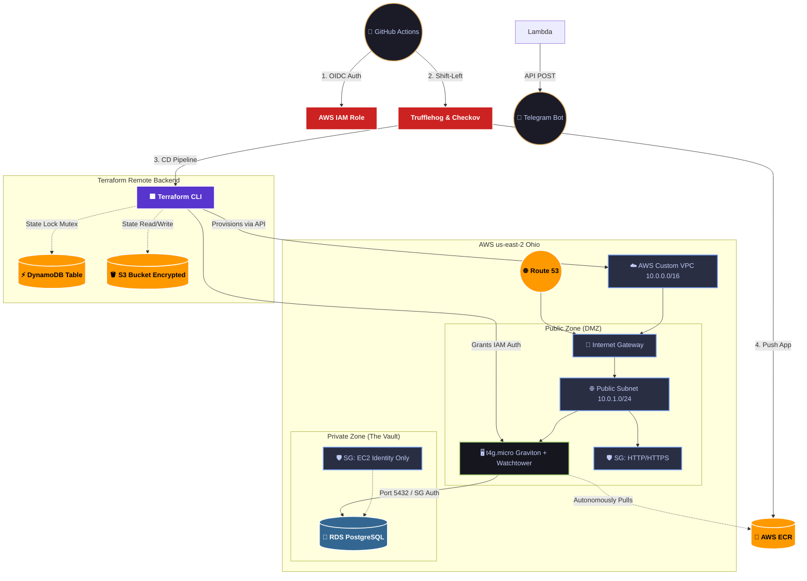

# ☁️ MyssTic Warden: Cloud Infrastructure (IaC)

This repository contains the Infrastructure as Code (IaC) and Configuration Management provisioning for the **MyssTic Warden** cloud environment, acting as the AWS backbone and production environment.

## 🏗️ Architecture & Security (Tier-3 Zero Trust & Shift-Left)

The infrastructure is strictly modularized (Networking, Compute, Database, Monitoring, DNS) and built from scratch with strict network boundaries, dynamic secrets, and automated security gates:

* **Shift-Left Security & OIDC:** The CI/CD pipeline authenticates with AWS via **OpenID Connect (OIDC)**, eliminating static credentials. Every push is audited by **Trufflehog** (secret scanning) and **Checkov** (IaC compliance) before deployment.
* **Networking (Multi-AZ):** Custom VPC (`10.0.0.0/16`) divided into a Public DMZ (`10.0.1.0/24`) and fully isolated Private Subnets (`10.0.2.0/24`, `10.0.3.0/24`). DNS is managed natively via Amazon Route 53.
* **Compute & Config Management:** Debian Linux running on an ARM64 Graviton instance (t4g.micro). Configuration is fully automated via **Ansible Enterprise Roles** (Docker, Traefik, Apps).
* **Zero Trust VPN & Deployment:** EC2 does not expose SSH (Port 22) to the internet. The GitHub Actions runner dynamically joins the **Tailscale** private network using an ephemeral AuthKey and executes Ansible playbooks securely via the internal Tailnet.
* **Persistence:** Amazon RDS (PostgreSQL 16) deployed exclusively within the Private Zone.
* **Zero Trust Security Groups:** Default-deny inbound traffic. EC2 only allows HTTP/HTTPS. The RDS database denies IP-based connections, authenticating traffic cryptographically via the EC2's Security Group identity.
* **Dynamic Secrets:** Passwords and tokens are never hardcoded or stored locally. Terraform extracts keys dynamically from **AWS Secrets Manager** at runtime.
* **Event-Driven Observability:** Automated Chaos/Failure detection. **Amazon CloudWatch** monitors EC2 metrics and triggers an **Amazon SNS** topic. An **AWS Lambda** function pushes real-time critical alerts to a Telegram Bot.
* **State Management:** Terraform state (`.tfstate`) is strictly managed via a **Remote Backend** using **Amazon S3** (AES-256 encryption) and **DynamoDB** for concurrent state locking.
* **GitOps Pull Automation:** EC2 instances are granted IAM Instance Profiles to securely authenticate with ECR without static keys. A local Watchtower agent autonomously polls the registry and orchestrates zero-downtime rolling updates for the application containers.

## 🗺️ Cloud Topology

## 🛠️ Tech Stack

* **Provisioning:** Terraform (HashiCorp) - Modular Architecture
* **Config Management:** Ansible (Roles structure)
* **Cloud Provider:** AWS (us-east-2)
* **Database:** Amazon RDS (PostgreSQL)
* **Serverless:** AWS Lambda, Amazon SNS, CloudWatch
* **Security:** AWS Secrets Manager, IAM OIDC, Tailscale VPN, Checkov, Trufflehog
* **State Backend:** AWS S3 + DynamoDB
* **CI/CD:** GitHub Actions
* **OS:** Debian Linux

## 🚀 Deployment Workflow (Continuous Deployment)

This repository enforces a strict GitOps workflow. Manual execution of `terraform apply` with local variables is deprecated.

1. **Security Gates:** Any push/PR triggers Trufflehog (secret scanning) and Checkov (IaC static analysis).
2. **Zero-Trust Auth:** The pipeline securely authenticates with AWS via OpenID Connect (OIDC), assuming a temporary IAM role.
3. **Immutable Provisioning:** Terraform initializes the remote backend, fetches dynamic secrets from AWS Secrets Manager in memory, and applies infrastructure changes.
4. **Configuration Delivery:** Post-provisioning, the GitHub Runner joins the private Tailnet using an ephemeral AuthKey and executes Ansible playbooks securely via SSH without exposing port 22.

---
*Maintained by MyssTic Warden Cloud Operations.*