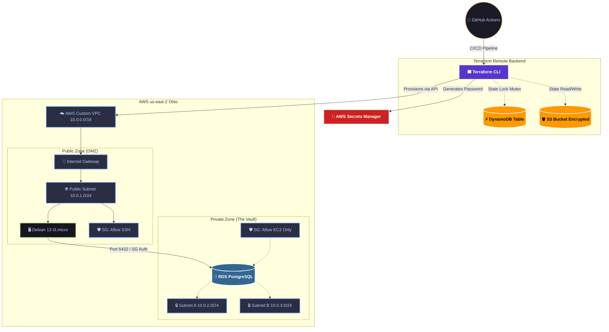

# ☁️ MyssTic Warden: Cloud Infrastructure (IaC)


This repository contains the Infrastructure as Code (IaC) provisioning for the **MyssTic Warden** cloud environment, acting as the AWS backbone and production environment.

## 🏗️ Architecture & Security (Tier-3 Zero Trust)

Instead of relying on default cloud settings, this infrastructure is built from scratch with strict network boundaries, dynamic secrets, and high availability in mind:

* **Networking (Multi-AZ):** Custom VPC (`10.0.0.0/16`) divided into a Public DMZ (`10.0.1.0/24`) and fully isolated Private Subnets (`10.0.2.0/24`, `10.0.3.0/24`).
* **Compute:** Debian 13 (Headless) running on a `t3.micro` instance, strictly hardened via UFW.
* **Persistence:** Amazon RDS (PostgreSQL 16) deployed exclusively within the Private Zone.
* **Zero Trust Security Groups:** Default-deny inbound traffic. EC2 only allows SSH. The RDS database denies IP-based connections, authenticating traffic cryptographically via the EC2's Security Group identity.
* **DevSecOps Secrets:** Passwords are never hardcoded. Terraform dynamically generates cryptographic keys, injecting them into **AWS Secrets Manager**.
* **State Management (Enterprise Grade):** Terraform state (`.tfstate`) is strictly managed via a **Remote Backend** using **Amazon S3** (object versioning, AES-256 encryption) and **DynamoDB** for concurrent state locking.

## 🗺️ Cloud Topology



## 🛠️ Tech Stack

* **Provisioning:** Terraform (HashiCorp)
* **Cloud Provider:** AWS (us-east-2)
* **Database:** Amazon RDS (PostgreSQL)
* **Security:** AWS Secrets Manager
* **State Backend:** AWS S3 + DynamoDB
* **CI/CD:** GitHub Actions
* **OS:** Debian Linux

## 🚀 Deployment Workflow (GitOps)

This repository enforces a GitOps workflow. Manual execution of `terraform apply` is deprecated for production environments.

1. **Continuous Deployment:** Any push to the `main` branch triggers the GitHub Actions pipeline.
2. The pipeline securely authenticates with AWS via injected Repository Secrets.
3. It automatically initializes the S3/DynamoDB backend, plans the infrastructure, and applies the changes.

*(For local testing and development only)*:
```bash
terraform init
terraform plan
terraform apply
```

> **Note:** The `terraform.tfstate` is excluded via `.gitignore` to prevent secret leakage. The absolute source of truth remains securely in AWS.

---
*Maintained by MyssTic Warden Cloud Operations.*